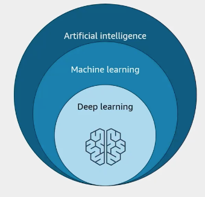

# AWS Certified AI Practitioner (AIF-C01)

## Domain 1: 

### 1.1: Explain Basic AI Concepts and Terminologies

- **Artificial intelligence** (AI): field of computer science dedicated to solving cognitive problems commonly associated with human intelligence, such as learning, creation, and image recognition. The goal with AI is to create self-learning system that derives meaning from data.

- **Machine learning** (ML): branch of AI and computer science that focuses on use of data and algorithms to imitate the way humans learn. It gradually improves its accuracy to build computer systems that learn from data. Machine learning models are trained by using large datasets to identify patterns and make predictions.

    - To train the algorithm to produce the output we expect, we give it known data, which consists of features. You can think of features as the columns in a table

- **Deep learning** is a type of machine learning model that is inspired by human brains using layers of neural networks to process information. 

- The decision to use traditional machine learning or deep learning depends on the type of data you need to process. Traditional machine learning algorithms will generally perform well and be efficient when it comes to identifying patterns from structured data and labeled data. On the other hand, deep learning solutions are more suitable for unstructured data like images, videos, and text. Tasks for deep learning include image classification and natural language processing

- **Generative AI** is accomplished by using deep learning models that are pre-trained on extremely large datasets containing strings of text or, in AI terms, sequences. They use transformer neural networks, which change an input sequence, in Gen AI known as prompt, into an output sequence, which is the response to your prompt. Neural networks process the elements of a sequence sequentially one word at a time. Transformers process the sequence in parallel, which speeds up the training and allows much bigger datasets to be used. 

- Predictions that AI makes are called **inferences**. Note that an inference is basically an educated guess, so the model gives a probabilistic result. The idea is to produce output from new data that it hasn't seen during training.

- **Natural language processing** (NLP) is what allows machines to understand, interpret, and generate human language in a natural-sounding way.

#### Machine learning

- Type of data:

    - structured: stored as rows in a table with columns, which can serve as the features for an ML model. Amazon RDS, or Amazon Redshift.

    - semi-structured data doesn't completely follow the rules of structured tabular data. Unlike data in a table, semi-structured data elements can have different attributes or missing attributes. Amazon DynamoDB and Amazon DocumentDB with MongoDB compatibility

    - unstructured data is data that doesn't conform to any specific data model and can't be stored in table format. Some examples include images, video, and text files, or social media posts. Typically stored as objects in an object storage system like Amazon S3.

    - time series data is important for training models that need to predict future trends. Each data record is labeled with a timestamp, and stored sequentially.

- The *training process* produces **model artifacts**, which typically consists of trained parameters, a model definition that describes how to compute inferences and other metadata. The model artifacts, which are normally stored in Amazon S3, are packaged together with inference code to make a deployable model. **Inference code** is the software that implements the model, by reading the artifacts.

- Type of inferences:

    - Real-time: low-latency, high trhoughput, persistent endpoint. Clients send input data to the model and receive back and inference very quickly.
    - Batch: offline processing, large amount of datam no persisten endpoint. You need a large number of inferences, and it's okay to wait for the results, batch processing can be more cost-effective.

- ML styles:

    - **supervised learning**: you train your model with data that is pre-labeled. Training data specifies both, the input and the desired output of the algorithm. The challenge with supervised learning is in labeling the data (this involves people). To address this challenge, Amazon offers a labeling service, Amazon SageMaker Ground Truth. It can leverage crowdsourcing service called Amazon Mechanical Turk that provides access to a large pool of affordable labor spread across the globe.

    - **unsupervised learning**: train on data that has features but is not labeled. They can spot patterns, group the data into clusters, and split the data into a certain number of groups. Unsupervised learning is useful for use cases such as pattern recognition, anomaly detection, and automatically grouping data into categories.

    - **reinforcement learning**: is a machine learning method that is focused on autonomous decision making by an agent. The agent takes actions within an environment to achieve specific goals. The model learns through trial and error, and training does not require labeled input. Actions that an agent takes that move it closer to achieving the goal are rewarded.

-   When a model performs better on training data than it does on new data, it is called **overfitting**. Usually, the best way to correct a model that is overfitting is to train it with data that is more diverse. Sometimes, if you train your model for too long, it will start to overemphasize unimportant features called **noise**, which is another way of overfitting. **Underfitting** is a type of error that occurs when the model cannot determine a meaningful relationship between the input and output data. Underfit models give inaccurate results for both the training dataset and new data. This can happen if you haven't trained the model long enough or with a large enough dataset.

- **Bias** is when there are disparities in the performance of a model across different groups. The results are skewed in favor of or against an outcome for a particular class. The quality of a model depends on the underlying data quality and quantity. Also, if a model is showing bias, the weight of features that are introducing noise can be directly adjusted by the data scientists.

### 1.2: Identify practical use cases for AI

#### ML problem types

- If your dataset consists of features or attributes as inputs with labeled target values as outputs, then you have a **supervised learning** problem

    - Classification: the task of predicting a discrete class label. For example, classifying an email as spam or not spam, or classifying a handwritten digit as a number from 0 to 9.

        - Binary: assigns an input to one of two predefined and mutually exclusive classes based on its attributes
        - Multiclass: assigns an input to one of several classes based on the input attributes.

    - Regression: the task of predicting a continuous quantity. Regression estimates the value of dependent target variable based on one or more other variables, or attributes that are correlated with it. Both logistic regression and linear regression require a significant amount of labeled data for the models to become accurate in predictions. For example, predicting the price of a house based on its size, location, and other features.

        - Simple linear: uses a single independent variable
        - Multiple linear: multiple independent variables
        - Logistic: used to measure the probability of an event occurring. The prediction is a value between zero and one, where zero indicates an event that is unlikely to happen, and one indicates a maximum likelihood that it will happen.

- If your dataset consists of features or attributes as inputs that do not contain labels or target values, then you have an **unsupervised learning** problem.

    - Clustering: When your data needs to be separated into discrete groups.

    - Anomaly detection: If you are seeking to spot outliers in your data.

#### AWS AI Service Use Cases

- **Amazon Rekognition** - Computer Vision Servic
    - Facial recognition and identification
    - Object detection and labeling in images/videos
    - Filter explicit/inappropriate content
    - Customizable to recognize proprietary objects
    
- **Amazon Textract** - Document Text Extraction
    - Extracts text, forms, tables from scanned documents

- **Amazon Comprehend** - Natural Language Processing
    - Sentiment analysis on text (e.g. customer feedback)
    - Detect personal identifiable information (PII) in text

- **Amazon Lex** - Conversational Interfaces
    - Build voice and text chatbots, virtual agents

- **Amazon Transcribe** - Automatic Speech Recognition
    - Live transcription and captioning of audio/video

- **Amazon Polly** - Text-to-Speech Service
    - Converts text into natural-sounding speech in dozens of languages
    - Uses deep learning to synthesize human speech
    - Convert articles to speech for accessibility
    - Interactive voice response systems for customer service

- **Amazon Kendra** - Intelligent Enterprise Search
    - Machine learning-powered search across enterprise systems
    - Natural language processing to understand complex questions
    - Quickly finds relevant content based on intelligent understanding
    - Responds to conversational queries like "how do I connect my Echo Plus?"

- **Amazon Personalize** - Recommendation Engine
    - Automatically generates personalized recommendations for customers
    - Used in retail, media, and entertainment industries
    - Powers "You might also like" product suggestions
    - Customer segmentation for targeted marketing campaigns

- **Amazon Translate** - Neural Machine Translation
    - Fluent translation between 75 different languages
    - Neural network considers full sentence context for accuracy
    - Real-time translation in chat applications
    - More accurate and fluent translations than traditional methods

- **Amazon Fraud Detector** - Fraud Prevention
    - Identifies potentially fraudulent online activities  
    - Pre-trained models for various fraud types 
    - Detects online payment fraud and fake account creation
    - Monitors product reviews, checkout processes, and account takeovers

- **Amazon Bedrock** - Generative AI Platform
    - Fully managed service for building generative AI applications
    - Access to foundation models from Amazon, Meta, and AI startups
    - Customize models with your own training data
    - Supports Retrieval Augmented Generation (RAG) for external knowledge

- **Amazon SageMaker** - Comprehensive ML Platform
    
    - End-to-end machine learning capabilities for data scientists and developers
    - Data preparation, labeling, and model training services
    - Large-scale parallel training on multiple instances or GPU clusters
    - Model deployment and real-time inference endpoints
    - Pre-trained models to accelerate development process

### 1.3: Describe the ML Development Lifecycle

- **Machine Learning Pipeline**: Series of interconnected steps from business goal to deployed model. Includes defining the problem, collecting and preparing data, training the model, deploying, and monitoring it.

- **ML Lifecycle Characteristics**: 
  - Models are dynamic and re-trained with new data
  - Continually evaluated against performance metrics
  - Monitored for drift and bias, adjusted as needed
  - Many phases are iterative and repeated after deployment

#### ML Pipeline Phases

##### Identify Business Goals

- **Problem Definition**: 
  - Start with clear business objectives and success criteria
  - Align stakeholders and evaluate if ML is the appropriate approach
  - Perform cost-benefit analysis before proceeding

##### Frame ML Problem

- **Data Preparation**: 
  - Ensure sufficient high-quality training data is available
  - Evaluate data sources for accessibility
  - Formulate ML question in terms of inputs, outputs, and metrics

- **Solution Selection**: 
  - Start with simplest solution before adding complexity
  - Investigate all options with business objectives in mind
  - Consider cost and scalability of each approach
  - AWS ML Solution Options (by complexity)

    - **Fully Managed AI Services**: 
        - Pay-as-you-go hosted models for common use cases
        - Example: Amazon Comprehend with custom classifiers
        - Fully trained and hosted by AWS

    - **Foundation Models with Fine-tuning**: 
        - Amazon Bedrock for generative AI use cases
        - SageMaker JumpStart for pre-trained computer vision and NLP models
        - Fine-tune with your data using transfer learning

    - **Custom Models from Scratch**: 
        - Most technically challenging and costly approach
        - Highest responsibility for security and compliance
        - Consider only when other options don't meet objectives

    - **Transfer Learning**: 
        - Use pre-trained models on large public datasets
        - Fine-tune with incremental training using your dataset
        - Significant cost and development time savings

##### Collect Data

- **Data Identification and Collection**:
  - Identify what training data is needed and where it's generated/stored
  - Determine if data is streaming or batch processing
  - Configure ETL (Extract, Transform, Load) processes for multiple sources
  - Store data in centralized repository for repeatable model re-training

- **Data Labeling**:
  - Determine if data is already labeled or needs labeling
  - Often the longest part of the process due to lack of accurately labeled data
  - Critical for supervised learning models

##### Pre-process data

- **Data Preparation**:
  - **Exploratory Data Analysis (EDA)**: Use visualization tools to understand data
  - **Data preprocessing**: Filter or repair missing/anomalous values, mask/remove PII
  - **Data splitting**: Typically 80% training, 10% evaluation, 10% final testing

##### Engineer features  

- **Feature engineering**: Select relevant characteristics that minimize error rate

- **Feature Optimization**:
  - Reduce features to only those needed for inference
  - Combine features to reduce total number
  - Reduces memory and computing power requirements

###### Data Services

- **AWS Glue** - Fully Managed ETL Service:
    - Create ETL jobs with few clicks in Management Console
    - Automatically discovers data and stores metadata in Glue Data Catalog
    - Generates code for data transformations and loading
    - Built-in transformations (drop duplicates, fill missing values, split datasets)
    - Supports various data stores including databases, warehouses, streaming services

- **AWS Glue Data Catalog**:
    - Contains references to data used in ETL jobs
    - Includes index of location, schema, and runtime metrics
    - Uses crawlers to automatically determine schema with classifiers
    - Stores only metadata, not source data itself

- **AWS Glue DataBrew** - Visual Data Preparation:
    - Clean and normalize data without writing code
    - Interactive discovery, visualization, cleaning, and transformation
    - 250+ built-in transformations with point-and-click interface
    - Save transformation steps in reusable recipes
    - Data quality evaluation with rule sets and profiling jobs

- **SageMaker Ground Truth** - Data Labeling:
    - Build high-quality labeled datasets for supervised learning
    - Active learning uses ML to automatically label data when possible
    - Human workforce options: Amazon Mechanical Turk or private workforce
    - Reduces manual labeling effort through intelligent automation

- **Amazon SageMaker Canvas** - Data Preparation:
    - Prepare, featurize, and analyze data with visual interface
    - Simplifies feature engineering process
    - Data Wrangler tool for selecting and importing raw data
    - 300+ built-in transformations without coding

- **Amazon SageMaker Feature Store**:
    - Centralized store for features and metadata
    - Easy feature discovery and reuse across ML development
    - Reduces repetitive data processing work
    - Create workflow pipelines to convert raw data into features

##### Train, Tune and Evaluate

- **Training Process**:
  - Iterative process where algorithm updates parameters/weights
  - Goal is to match inference with expected output
  - Algorithm learns from previous iterations to reduce error
  - Stops when defined iterations reached or error below target value

- **Experimentation**:
  - Run multiple training jobs in parallel with different algorithms and settings
  - Each algorithm has hyperparameters set by data scientists before training
  - Hyperparameters include neural layers, nodes in deep learning models
  - Optimal values determined through multiple experiments

###### Training Services

- **Amazon SageMaker Training Jobs**:
    - Create training job that runs code on managed ML compute instances
    - Specify S3 bucket URL containing training data
    - Define compute resources and output bucket for model artifacts
    - Specify algorithm via Docker container image path in Amazon ECR
    - Set hyperparameters required by the algorithm
    - SageMaker launches instances, trains model, saves artifacts to S3

- **Amazon SageMaker Experiments**:
    - Create, manage, analyze, and compare ML experiments
    - Experiment is group of training runs with different inputs/parameters
    - Visual interface to browse active and past experiments
    - Compare runs on key performance metrics
    - Identify best-performing models from thousands of training runs

- **Amazon SageMaker Automatic Model Tuning (AMT)**:
    - Also known as hyperparameter tuning
    - Finds best model version by running many training jobs
    - Uses algorithm and hyperparameter ranges you specify
    - Chooses hyperparameter values that optimize chosen metric
    - Example: maximize area under curve for binary classification
    - Runs training jobs in loop until completion criteria satisfied
    - Completion criteria based on number of jobs no longer improving metric

##### Deploy

- **Inference Types**:
  - **Batch inference**: Large number of inferences, can wait for results (most cost-effective)
  - **Real-time inference**: Immediate response required, persistent endpoint with REST API
  - Decision based on business requirements and cost considerations

- **Deployment Architecture**:
  - Inference code and model artifacts deployed as Docker containers
  - Containers can run on various AWS compute services (Batch, ECS, EKS, Lambda, EC2)
  - Example: API Gateway interfaces with clients and forwards requests to Lambda function running the model
  - Different services require varying levels of operational management (updates, patches, scalability, security)

###### Deployment Services

- **Amazon SageMaker endpoints**:
  - Fully managed hosting with reduced operational overhead
  - Point SageMaker to model artifacts in S3 and container image in ECR
  - Automatically creates and manages endpoints
  - Runs models on EC2 ML instances with auto scaling support
  - Inference Recommender tool tests configurations to find optimal setup

- **SageMaker Inference Options** (Four Types):
  - **Batch Transform**: Offline inference for large datasets (gigabytes), no persistent endpoint needed
  - **Asynchronous Inference**: Queue requests with large payloads and processing times, scales down to zero during idle periods
  - **Serverless Inference**: Real-time responses using Lambda functions, pay only when running or pre-provisioned. Serverless inference has a processing time of up to 60 seconds.
  - **Real-time Inference**: Persistent fully managed REST API endpoint for sustained traffic with immediate responses

##### Monitor

- Model performance degrades over time due to data quality, model quality, and model bias issues. The monitoring system must capture data, compare it to the training set, define rules to detect issues, and send alerts. This process repeats on a scheduled basis, when initiated by an event, or through human intervention.

- **Data drift** is when there are significant changes to the data distribution compared to the data used for training. **Concept drift** is when the properties of the target variables change. Any kind of drift results in model performance degradation.

- For most ML models, a simple scheduled approach for re-training daily, weekly, or monthly is usually sufficient. The monitoring system should detect data and concept drifts, initiate alerts, and send them to an alarm manager system.

###### Monitoring Services

- **Amazon SageMaker Model Monitor** - Production Model Monitoring
    - Monitors models in production and detects errors for remedial actions
    - Define monitoring schedule that collects data from endpoints
    - Detects changes against baseline using built-in or custom rules
    - View results in SageMaker Studio and configure CloudWatch alarms for automated re-training

#### MLOps (Machine Learning Operations)

- **MLOps** is about applying established software engineering best practices to machine learning model development. It focuses on automating manual tasks, testing and evaluating code before release, and responding automatically to incidents.

- MLOps streamlines model delivery across the ML development lifecycle. Because cloud uses API-based services, everything is treated as software, including infrastructure. The entire infrastructure can be described in software and deployed in repeatable fashion.

- Key MLOps principles include version control for tracking lineage (including training data), monitoring deployments to detect issues, and automating re-training due to issues or data/code changes.

- MLOps benefits:
    - **Productivity**: Automation and self-service environments let data scientists move faster
    - **Repeatability**: Automating ML lifecycle steps ensures repeatable processes
    - **Reliability**: Deploy quickly with increased quality and consistency
    - **Compliance**: Improved auditability by versioning all inputs and outputs
    - **Quality**: Enforce policies against model bias and track data/model changes over time

###### Workflow Orchestration Services

- **Amazon SageMaker Pipelines** - ML Pipeline Orchestration
    - Orchestrate SageMaker jobs and author reproducible ML pipelines
    - Create pipelines using SageMaker SDK for Python or JSON
    - Include conditional branches based on previous step outputs
    - View pipelines in SageMaker Studio

- **AWS Step Functions** - Visual Workflow Builder
    - Define workflows with visual drag-and-drop interface
    - Build serverless workflows integrating various AWS services
    - Custom application logic integration capabilities

- **Amazon Managed Workflows for Apache Airflow** - Open Source Workflow Management
    - Use Apache Airflow and Python to create workflows
    - Programmatically author, schedule, and monitor workflow sequences
    - Managed infrastructure for scalability, availability, and security

##### Repositories

- **Repositories** are where you keep versions of your code and models for MLOps workflows.

###### Repository Services

- **SageMaker Feature Store** - Feature Repository
    - Repository for feature definitions of training data
    - Centralized store for features and associated metadata
    - Easy feature discovery and reuse across ML development

- **SageMaker Model Registry** - Model Repository
    - Centralized repository for trained models and history
    - Version control for model artifacts and lineage tracking
    - Manage model deployment lifecycle

#### Model Evaluation Metrics

- Models need to be evaluated against target metrics to measure performance. A **confusion matrix** is used to summarize the performance of a classification model when evaluated against test data.

##### Confusion Matrix Components

- **True Positive (TP)**: Model correctly predicts positive class (e.g., correctly identifies a fish as a fish)
- **True Negative (TN)**: Model correctly predicts negative class (e.g., correctly identifies non-fish as non-fish)
- **False Positive (FP)**: Model incorrectly predicts positive class (e.g., identifies non-fish as fish)
- **False Negative (FN)**: Model incorrectly predicts negative class (e.g., identifies fish as non-fish)

##### Performance Metrics

- **Accuracy**: Percentage of correct predictions. Not a good metric for imbalanced datasets. Formula: (TP + TN) / Total predictions. Values range from 0 to 1, where 1 indicates perfect accuracy.

- **Precision**: Measures how well algorithm predicts true positives out of all positives identified. Good metric when goal is to minimize false positives (e.g., avoid labeling legitimate email as spam). Formula: TP / (TP + FP).

- **Recall (Sensitivity)**: Measures ability to find all positive instances. Good metric when goal is to minimize false negatives (e.g., ensure disease detection). Formula: TP / (TP + FN).

- **F1 Score**: metric that you can use to measure errors in *classification* tasks. Balances precision and recall by combining them in a single metric. Best compromise when both precision and recall are important. There is a tradeoff between precision and recall - you can't optimize for both simultaneously.

- **False Positive Rate**: Measures how model handles negative class. Shows how many predictions were positive out of images that were actually negative. Formula: FP / (FP + TN).

- **True Negative Rate**: Ratio of true negatives to sum of false positives and true negatives. Measures how many predictions were negative out of images that were actually negative. Formula: TN / (FP + TN).

- **Area Under the Curve (AUC)**: Used for binary *classification* algorithms that return probabilities, such as logistic regression. Maps probabilities into discrete predictions using a threshold value. The **threshold** is a value the model uses to make decisions between two classes - it converts probability into binary decision.

    - **Receiver Operating Characteristic (ROC) Curve**: Plots true positive rate against false positive rate for increasing threshold values. Increasing threshold results in fewer false positives but more false negatives.
    
    - AUC provides aggregated measure of model performance across full range of thresholds. Scores range 0-1, where 1 indicates perfect accuracy and 0.5 indicates prediction no better than random classifier.

##### Regression Metrics

- **Mean Squared Error (MSE)**: Used to evaluate linear *regression* models. Takes difference between prediction and actual value, squares the difference, then computes average of all squared differences. MSE values are always positive - smaller values indicate better performance.

- **Root Mean Squared Error (RMSE)**: Square root of MSE. Advantage is units match the dependent variable, making it easier to interpret than MSE (e.g., if height measured in inches, MSE is in square inches but RMSE is in inches).

- **Mean Absolute Error (MAE)**: Averages absolute values of errors without squaring them. Doesn't emphasize large errors like MSE/RMSE do. Good metric when incorrect predictions are very costly and you don't want to emphasize outliers.

#### Business Metrics and ROI

- ML solutions must be rooted in solving business problems. The first step in the ML pipeline is defining the business goal, then determining how to measure successful achievement of that goal.

- **Business metrics** help quantify the value of ML models to the business. Good metrics include cost reduction, percentage increase in users or sales, measurable improvement in customer feedback, or any metric important to the business.

- Important to estimate risks of using AI/ML and potential costs from errors (e.g., loss of sales or customers). After model is in production, collect data to support metrics and compare actual results with original business goals.

- Consider actual cost of building and operating the model compared to initial cost-benefit analysis to calculate return on investment.

##### Cost Tracking

- **AWS Cost Allocation Tags**: Define tags assigned to resources you create (e.g., ML project name as tag). Add tags to all pipeline resources, then filter cost reports in AWS Cost Explorer to determine actual AWS charges for the project.

## Domain 2:

### 2.1: Explain The Basic Concepts Of Generative AI

- **Generative AI** is a subset of deep learning. Like deep learning, generative AI is a multipurpose technology that helps to generate new original content rather than finding or classifying existing content.

- **Foundation Models** are built with neural networks, system resources, data, and prompts, all working together. When you build a model, you train it with the knowledge it needs togenerate unique output based on what it has learned. The models take the data or text that you input and provide an output. This output is a guess of what the next word or token should be.

- **Large language models (LLMs)** are one class of FMs. They can extract meanings from a sequence of text and understand the relationships between words and phrases in it.

- The current, core element of generative AI is the **transformer network**. The transformer model uses self-attention to compute representations of input sequences, which helps the model to capture long-term dependencies and parallelize computation.

    - Transformer architecture consists of an encoder and a decoder, each of which is composed of several layers. Each layer consists of two sub-layers. The transformer model also uses residual connections and layer normalization to facilitate training and prevent overfitting.

- **Context window**: is the limited amount of text or data that a model can consider at one time when processing information.

- One strategy you can use to get the model to produce better completions is to include examples of the task that you want the model to carry out. These examples can be incorporated inside the prompt. Providing examples inside the context window is called **in-context learning**.

- **Tokenizer**: a tool that breaks text into smaller units, or tokens (vectors), to help machines understand and process language.

- **Prompt engineering**: the process where you guide, via prompts, generative AI solutions to generate desired outputs.

- **Completion**: refers to the generated text output produced by the model based on a given prompt.

- **Vector**: a mathematical representation of data as an ordered list of numbers, containing multiple features (attributes) of a data point (value). The power of vector representations is in the ability to encode related relationships between the items and capture meaningful associations, analogies, and hierarchies.

- **Embeddings**: a numerical representation of real-world objects (like words, images, or audio) as points in a continuous vector space. Embeddings are a numerical vectorized representation of any entity. Embeddings capture the semantic meaning of tokens such as text, image, video, or audio. 

- The closer the tokens are to each other in the vector space, the more similar they are in the semantic meaning.

- Generative AI can be unimodal or multimodal. **Unimodal** models work with one data modality. LLMs are an example of unimodal generative AI because the input and the output, or completion, are text. **Multimodal** is adding another modality such as image, video, or audio.

- **Diffusion models** support a variety of tasks for multimodal models such as image generation, upscaling, and inpainting. Diffusion models are a class of generative models that learn to reverse a gradual noising process. Diffusion-based architectures offer a higher degree of control in quality and diversity of images generated.

    - The **forward diffusion** process consists of gradually adding Gaussian noise to an input image step by step, for a total of T steps.
    - The **reverse diffusion** process is responsible for taking what was learned in the forward diffusion process to inform a deep learning model that approximates a recreation of an image.

    - **Stable Diffusion** differs from many other image generation models. In principle, diffusion models use Gaussian noise to encode an image. Then, they use a noise predictor together with a reverse diffusion process to recreate the image. Stable Diffusion doesn’t use the pixel space of the image. Instead, it uses a reduced-definition latent space

- Learning methods in machine learning:

    - Zero-Shot Learning:

        - No training examples needed for the target task
        - Model can recognize or perform tasks it hasn't explicitly been trained on
        - Uses knowledge transferred from related tasks/domains
        - Example: A model trained to recognize cats and dogs might understand "furry animal" and can then identify a rabbit without specific rabbit training
        
    - One-Shot Learning:

        - Learns from just one example per class/task
        - Particularly useful when training data is scarce
        - Often uses similarity-based comparisons
        - Example: Facial recognition system that can identify a person after seeing just one photo of them

    - Few-Shot Learning:

        - Uses a small number of examples (typically 2-5) per class/task
        - Bridges gap between zero-shot and traditional learning
        - Leverages prior knowledge to learn from limited data
        - Example: Teaching a model to recognize a new object category with just 3-4 images

### 2.2: Understand The Capabilities & Limits Of Gen AI For Solving Business Problems

- When selecting a model or an algorithm, consider **interpretability**. The higher the interpretability of a machine learning model, the easier it is to comprehend the model's predictions, but you have a tradeoff to consider. It's between what the model has predicted, which is the model performance, and why the model made such a prediction, which is the model interpretability. 

- Interpretability can be classified into intrinsic analysis and post hoc analysis. 

    - Intrinsic analysis can be applied to interpret models that have low complexity or simple relationships between the input variables and the predictions.
    - Post hoc analysis can be applied to interpret simple relationship models and more complex models, such as neural networks, which can capture non-linear interactions.

- Use metrics to assess the performance of your models and compare it to other models out in the world. In traditional machine learning, you can assess how well a model is performing on training and validation datasets where the output is already known. You're able to calculate basic metrics, such as accuracy. But with LLMs, the output is non-deterministic and language-based evaluation is much more challenging

- GenAI models include: Generative adversarial networks (GANs), Variational autoencoders (VAEs), Transformers, Recurrent neural networks (RNNs), Reinforcement learning for generative tasks, Difussion, Flow-based, Bidirectional encoder representation from transformers (BERT), Generative Pre-trained Transformers (GPT), Amazon Titan/Nova FMs, Jurassic, Claude, Cohere, Stable Difussion, Bloom.

- Performance metrics include: Accuracy, Cross-domain performance (evaluate the transfer and application of knowledge and skills across different domains), Efficiency, Conversion rate, Average revenue per user, Customer lifetime value.

### 2.3: Describe Aws Infrastructure & Technologies For Building Gen AI Applications

- AWS Cloud Adoption Framework for Artificial Intelligence, Machine Learning, and Generative AI (CAF-AI). It serves as both a starting point and a guide for your journey in AI, ML, and generative AI. The framework can be used as a resource for discussions about your AI strategy,

- What are the pricing models for LLMs? One pricing model is to host LLMs on your own infrastructure. You are responsible for paying for the computing resources that are required to run these models. And you might have to pay a license fee for the LLM itself. You can also choose to pay by token pricing model.

- **Amazon SageMaker JumpStart** 

    - Model hub and that helps quickly deploy foundation models that are available within the service and integrate them into your applications.
    - It provides fine-tuning and deploying models, and also helps you get quickly into production to operate at scale.
    - Provides a lot of resources in terms of blogs, videos, and example notebooks

- **Amazon Bedrock** 

    - Managed AWS service that lets you use and access a number of different foundation models, FMs, using APIs.
    - These foundation models include models that are curated by AWS in addition to foundation models provided by third parties.
    - Adds the capability to import custom weights for supportive model architectures, and serve the custom model by using on-demand mode. You only pay for what you use with no time-based term commitment.

- Playgrounds in Amazon Bedrock let you experiment by running model inference against different base foundation models that are supported within the service to help you align your use cases with the highest accuracy. Depending on the model selected for your playground, it will determine the right types of inference parameters that you can adjust. And remember, you can vary the number of inference parameters to determine different completion results. **PartyRock** is a playground built on Amazon Bedrock

## Domain 3:

### 3.1: Describe Design Considerations For Applications That Use FMs

- Selection criteria to choose pre-trained models: 

    - cost (+complexity -> +performance -> +cost), 
    - modality (single or ensemble methods which combine several models to achieve better performance), 
    - latency (like inference speed or duration it takes a model to process data and produce a prediction), 
    - multilingual, 
    - model size, 
    - model architecture/complexity (number of parameters, layers and operations), 
    - customization (modify or extend the pre-trained model to suit your task, such as adding new layers, classes, or features), 
    - availability/compatibility (updated and maintained regularly and whether it has any known issues or limitations), 
    - interpretability (being transparent, and provide tools or methods to visualize or interpret their inner workings. FMs are not interpretable by design because they are extremely complex),
    - explainability (attempts to explain models black box, by approximating it locally with a simpler model that is interpretable)
    - input and output length.

- Parameters that control **inference**: help control the behavior and output characteristics of the FMs:

    - Temperature:
        
        - Controls the randomness/creativity of the model's output. Range is typically 0 to 1.
        - Lower values (e.g., 0.1) make responses more focused and deterministic. Higher values (e.g., 0.8) make responses more diverse and creative
        
    - Top K Sampling:

        - Limits the model to choose from only the K most likely next tokens. Helps prevent the model from selecting highly improbable tokens
        - Lower K values make output more focused and conservative. Higher K values allow more variety in responses.

    - Top P Sampling (also called nucleus sampling):

        - Selects from the smallest set of tokens whose cumulative probability exceeds probability P. More dynamic than Top K as it adapts to the probability distribution.
        - Lower P values (e.g., 0.1) make output more focused. Higher P values (e.g., 0.9) allow more diverse responses

    - Response length, penalties, and stop sequences

- Prompt: specific set of inputs provided by you the user. These inputs guide LLMs to generate an appropriate response or output for a given task or instruction. You can also add contextual data from your internal databases to enrich the prompt. You can integrate additional domain-specific data from these data stores or vector data stores that add to your prompts semantically relevant inputs. This method is called retrieval augmented generation, **RAG**. 

#### RAG

- Enhances language models to retrieve and use external knowledge during the generation process (i.e Amazon Bedrock Knowledge Bases). Helps solving hallucinations.

- Combines two components, a retriever component, which searches through a knowledge base and a generator component, which produces outputs based on the retrieved information. 

- When I want to query the model, the prompt is passed into the query encoder, which encodes or embeds the data into the same format as the external data. Then the embedding can be passed to the vector database to search and return similar embeddings that have been through the model. Those embeddings are then attached to my new query and can also be mapped back to their original location. If the vector database finds similar data, then the retriever retrieves that data, the LLM combines or augments the new data or text with the original prompt, then the prompt is sent to the LLM to return a completion.

#### Vector Databases

- Amazon OpenSearch Service, Amazon Aurora, Redis, Amazon Neptune, Amazon DocumentDB with MongoDB compatibility, and Amazon RDS with PostgreSQL.

- The OpenSearch search engine delivers low-latency search and aggregations. You can implement semantic search (improve the retrieved results by using language-based embeddings on search documents)

#### Agents

- Are an additional piece of software that orchestrates the prompt completion workflows and interactions between the user requests, foundation model, and external data sources or applications. Also, agents automatically call APIs to take actions and invoke knowledge bases to supplement information for these actions.

- Agents for Amazon Bedrock is a fully managed AI capability from AWS to help you build applications foundation models.

### 3.2: Choose Effective Prompt Engineering Techniques

- A prompt contains components that you want the LLM to perform such as the task or instruction, the context of that task or instruction and the input text that you want for the response or output.

- Concepts:

    - Few-shot prompting: when you provide a few examples to help the LLM models better perform and calibrate their output to meet your expectations
    - Zero-shot prompting: it is a sentiment classification prompt with no examples provided to the prompt.
    - Prompt template: they might include instructions, few-shot examples, and specific content and questions for different use cases. 
    - Chain-of-thought prompting: if you have more complex tasks, to break down the reasoning process into intermediate steps. This kind of prompting can improve the quality and coherence of the final output.
    - Prompt tuning: where the actual prompt text is replaced with a continuous embedding backer that is optimized during training. This technique helps the prompt to be fine-tuned for a specific task. At the same time, it keeps the rest of the model parameters frozen, which can be more efficient than full fine-tuning

- **Latent space**: database of statistics. Is the encoded knowledge of language in a LLM. It's the stored patterns of data that capture relationships and, when prompted, reconstruct language from those patterns. A key part of advanced prompt engineering is knowing the limitations of a language model's latent space. You must assess its latent space for a given topic to know what it knows about that topic before you can start constructing prompts. Otherwise, you'll prompt it for things that it doesn't know well, and the answers you will get back will have a high chance of hallucination

- Prompt engineering has several key techniques. 

    - First, be specific and provide clear instructions or specifications for the task at hand. 
    - Second, include examples of the desired behavior and direction, 
    - Third, experiment and use an iterative process to test prompts and understand how the modifications alter the responses. 
    - Fourth, know the strengths and weaknesses of your model. 
    - Fifth, balance simplicity and complexity in your prompts to avoid vague, unrelated, or unexpected answers. 
    - Six, specifically for your prompt engineers, use multiple comments to offer more context without cluttering your prompt. 
    - Seventh, add guardrails. Identify potential risks and limitations of prompt engineering.

#### Risks

- Prompt Injection: Attacks involving prompt manipulation, where a trusted prompt is combined with untrusted user input to produce malicious or undesired responses.
- Jailbreaking: Attempts to bypass the safety measures and guardrails established to prevent malicious responses.
- Hijacking: Efforts to change or manipulate the original prompt with new instructions.
- Poisoning: The risk of embedding harmful instructions in messages, emails, web pages, and other media.

### 3.3: Describe The Training And Fine-Tuning Process For FMs

- Key elements of training a foundation model? They include pre-training, fine-tuning, and continuous pre-training.

- Pre-training: it requires millions of graphic processing units, GPUs, compute hours, terabytes and petabytes of data, trillions of tokens, trial and error, and time. During the pre-training, generative AI models learn its capabilities. You train the LLM by using huge amounts of unstructured data with self-supervised learning.

- Fine-tuning: is a process that extends the training of the model to improve the generation of completions for a specific task. It is a supervised learning process and you use a dataset of labeled examples to update the weights of the LLM. However, there is a possible limitation to fine-tuning on a single task, which is catastrophic forgetting.

    - **Catastrophic forgetting** happens when the whole fine-tuning process modifies the weights of the original LLM. This can improve the performance of the single task fine-tuning, but it can degrade performance on other task

- Fine-tuning techniques:

    - Instruction-based fine-tuning uses labeled examples to improve the performance of a pre-trained foundation model on a specific task. The labeled examples are formatted as prompt, response pairs and phrased as instructions. This fine-tuning process modifies the weights of the model.
    - Parameter-efficient fine-tuning (PEFT): freeze or preserve the parameters and weights of the original LLM and fine-tune or train a small number of task-specific adaptor layers and parameters. PEFT reduces the compute and memory that's needed because it's fine-tuning a small set of model parameters
    - Low-rank adaptation (LoRA): is a popular PEFT technique that also preserves or freezes the original weights of the foundation model. PEFT and LoRA modify the weights of your model, but not the representations.
    - Representation fine-tuning (ReFT): is a fine-tuning process that freezes the base model and learns task-specific interventions on hidden representations.
    - Multitask fine-tuning is an extension of fine-tuning a single task. Multitask fine-tuning requires a lot of data. For this process, the training dataset has examples of inputs and outputs for multiple tasks. Helps mitigate and avoid catastrophic forgetting.
    - Domain adaptation fine-tuning gives you the ability to use the pre-trained foundation models and adapt them to specific tasks by using limited domain-specific data. Modifies the weights of the model to adapt to domain-specific data.
    - Reinforcement learning from human feedback (RLHF): improve the performance of your model and help it better understand human-like prompts to generate human-like responses.

- Preparing the data to fine-tune the FM:

    - Prepare your training data: 
    - Select prompts: the prompt template libraries include many templates for different tasks and datasets.
    - Calculate loss: after your instruction dataset is ready, you can divide the dataset into training validation, and test splits. During fine-tuning, you select prompts from your training dataset and pass them to the LLM to generate completions. Then, compare the distribution of completions, and the training label, to calculate a loss
    - Update the weights: after many batches of prompt completion pairs, update the weights so the model's performance on the task improves.
    - Define evaluation steps: to measure your LLM's performance, by using the holdout validation dataset.

- Services for Data preparation:

    - SageMaker Canvas: create data flows that define your ML data pre-processing. Use little to no coding.
    - Open source frameworks such as Apache Spark, Apache Hive, or Presto. 
    - SageMaker Feature Store: search, discover, and retrieve features for model training. You can also use it to provide a centralized repository to store feature data in a standardized format.
    - SageMaker Clarify: analyze your data and detect potential biases across multiple facets.
    - SageMaker Ground Truth: manage the data labeling workflows for your training datasets.

### 3.4: Describe Methods To Evaluate Fm Performance

- Evaluation metrics more task-specific:

    - **ROUGE**, or Recall-Oriented Understudy for Gisting Evaluation, is primarily employed to assess the quality of automatically-generated summaries by comparing them to human-generated reference summaries.
    - **BLEU**, or Bilingual Evaluation Understudy, is an algorithm designed to evaluate the quality of machine-translated texts by comparing it to human-generated translations.

- Without a task-specific focus, you can use existing benchmarks and datasets that LLM researchers have established specifically for this purpose. 

    - **GLUE**, or General Language Understanding Evaluation, help the development of models that can generalize across multiple tasks. Evaluate and compare model performance across a set of language tasks.
    - **MMLU**, or Massive Multitask Language Understanding, evaluates the knowledge and problem-solving capabilities of the model.
    - **Big-bench**, or Beyond the Imitation Game Benchmark, focuses on tasks that are beyond the capabilities of the current language models. It contains tasks such as math, biology, physics, bias, linguistics, reasoning, childhood development, software development, and more.
    - **HELM**, or Holistic Evaluation of Language Models, which is a benchmark to help improve model transparency. It offers users guidance on which model performs well for a given task.

- **Semantic robustness**: evaluates how much your model output changes as the result of small, semantic-preserving changes in the input.

- GenAI Application Stack:

## Domain 4:

### 4.1: Explain The Development of AI Systems That Are Responsible

- Responsible AI: set of guidelines and principles to ensure that AI systems operate in a safe, trustworthy, and responsible manner. It has core dimensions:

    - Fairness: aims to ensure that models treat everyone equitably and impartially regardless of their age, where they live, their gender, or their ethnicity. It is measured by the bias and variance of outcomes across different group.
    - Explainability: explain in human terms why a model made a particular decision.
    - Robustness: makes sure that AI systems are tolerant of failures and minimize errors. 
    - Privacy and security: about protecting user privacy and not exposing personal identifiable information
    - Governance: is about meeting and auditing compliance with industry standards and best practices, including estimating properly and mitigating risk. 
    - Transparency: is about providing clear information about model capabilities, limitations, and potential risks to stakeholders. Includes making sure that users know when they are interacting with AI

- One of the main reasons for model bias is **class imbalance**: occurs when a feature value has fewer training samples when compared with another value in the dataset. As a result, the model could have a higher error rate for a class.

- Responsible datasets are the foundation of responsible AI because biases in the training dataset will become biases in the output. It should have: inclusivity, diversity, balanced datasets, privacy protection, consent and transparency, regular audits

#### AWS Services for Responsible AI

##### Amazon SageMaker Clarify - Bias Detection and Model Explainability

- **Purpose**: Helps mitigate bias by detecting potential bias during data preparation, after model training, and in deployed models
- **Functionality**: Examines specific attributes to measure model bias, trustworthiness, and truthfulness
- **Explainability**: Improves model explainability by analyzing inputs and outputs, treating model as black box to determine relative importance of each feature

##### How SageMaker Clarify Works

- **Processing Jobs**: Uses SageMaker Clarify processing container to interact with S3 buckets containing input datasets and deployed models
- **Analysis Process**:
  1. Obtains input dataset and configuration from S3
  2. Sends requests to model container for predictions
  3. Computes and saves analysis results to S3
- **Output**: JSON file with bias metrics, global feature attributions, visual reports, and local feature attribution files

#### Bias Metrics and Analysis

##### Training Dataset Bias Metrics

- **Balanced Dataset Importance**: Prevents errors for particular classes (e.g., model trained on middle-aged data may be less accurate for younger/older people)

- **Label Imbalance**: When labels favor positive outcomes for one class over another (e.g., loans approved at higher rate for middle-aged individuals)

- **Demographic Disparity**: Measures if particular class has larger proportion of rejected outcomes than accepted outcomes
  - Example: Women comprised 46% of rejected college applicants but only 32% of accepted applicants

##### Trained Model Bias Metrics

- **Difference in Positive Proportions**: Indicates whether model predicts positive outcomes differently for each class
  - Compares with label imbalance in training data to see if bias changes after training

- **Specificity Differences**: Measures how often model correctly predicts negative outcomes across classes
  - Lower specificity for one group indicates bias against other groups

- **Recall Difference**: Difference in recall (true positive rate) between classes
  - High recall for one class but low for another indicates bias

- **Accuracy Difference**: Difference in prediction accuracies between classes
  - Can occur when data contains class imbalance

- **Treatment Equality**: Difference in ratio of false negatives to false positives between classes
  - Different types of errors for different classes constitute bias
  - Example: More incorrect loan denials for one class vs. more incorrect approvals for another

#### Hallucination
- **Definition**: When model makes up content that sounds factual but is actually fiction
- **Cause**: AI attempts to fill gaps when something is missing in training data
- **Impact**: Can be disastrous depending on use case

#### Intellectual Property Risks
- **Copyright Issues**: 
  - AI-generated works cannot be copyrighted (not human-created)
  - Models may be trained on copyrighted data, leading to protected content in outputs
  - Users can input copyrighted works, creating unlicensed derivatives

#### Data Privacy Concerns
- **Sensitive Data Leakage**: PII, intellectual property, trade secrets, healthcare records can leak into outputs
- **Sources**: Data present in training sets or user prompts
- **Permanence Problem**: Once model is trained on data, it cannot "forget" by simply deleting the data

#### Performance trade-off analysis

Perform alternative trade-off analysis to obtain optimal performance and accuracy for a given use-case data and business requirement.

- Accuracy versus complexity trade-off: The simpler a machine learning model is, the more explainable are its predictions. Deep learning predictions can potentially outperform linear regression or a decision tree algorithm, but at the cost of added complexity in interpretability and explainability.

- Bias versus fairness trade-off: Define a process for managing risks of bias and fairness in model performance. Business value most often aligns with models that have considered historical or sampling biases in the training data. Further consideration should be given to the disparate impact of inaccurate model predictions. For example, underrepresented groups are often more impacted by historical biases, which might perpetuate unfair practices.

- Bias versus variance trade-off (supervised ML): The goal is to achieve a trained model with the lowest bias versus variance tradeoff for a given data set. To help overcome bias and variance errors, you can use:

    - Cross validation

    - More data

    - Regularization

    - Simpler models

    - Dimension reduction (Principal Component Analysis)

    - Stop training early

- Precision versus recall trade-off (supervised ML): This analysis can be important when precision is more important than recall or vice versa. For example, optimization of precision is more important when the goal is to reduce false positives. However, optimization of recall is more important when the goal is to reduce false negatives. It’s not possible to have both high precision and high recall-if one is increased, the other decreases. A trade-off analysis helps identify the optimal option for analysis.

#### AWS Solutions for Responsible AI

##### Amazon Bedrock Guardrails
- **Purpose**: Filter and block inappropriate content in foundation models
- **Content Filters**: Configure thresholds for hate, insults, sexual content, violence
- **Topic Blocking**: Block entire topics using plaintext descriptions
- **Process**: 
  1. User prompts pass through guardrails first
  2. Blocked prompts receive violation response
  3. Guardrails apply to both prompts and model responses

##### Amazon SageMaker Clarify - LLM Evaluation
- **Evaluation Jobs**: Compare large language models across different tasks
- **Supported Tasks**: Text generation, classification, Q&A, summarization
- **Evaluation Dimensions**:
  - **Prompt Stereotyping**: Measures bias probability across demographics
  - **Toxicity**: Checks for sexual references, hate speech, profanity, threats
  - **Factual Knowledge**: Verifies accuracy of model responses
  - **Semantic Robustness**: Tests output consistency with typos, case changes, whitespace
  - **Accuracy**: Compares output to expected responses

- **Data Sources**: Built-in prompt datasets or custom datasets
- **Human Feedback**: Can incorporate workforce feedback from employees or subject matter experts
- **Bedrock Integration**: Same capabilities available in Bedrock console for pre-trained LLMs

### 4.2: Recognize The Importance of Transparent And Explainable Models

#### Model Transparency

- **Transparency**: Measures the degree to which ML owners and stakeholders can understand how a model works and why it produces its outputs. The degree of transparency required often depends upon regulatory requirements to protect consumers against bias and unfairness.

- **Two Measures of Transparency**:
  - **Interpretability**: Understanding the inner mechanisms of how a model works
  - **Explainability**: Being able to describe what a model is doing without knowing exactly how. Process of explaining a model's behavior in human terms. 

#### Interpretability vs Explainability

- **Highly Transparent Models**: Use straightforward algorithms that are easy to interpret
  - **Linear regression**: Can see the slope and intercept of a line and how it's used
  - **Decision trees**: Produce basic and understandable rules

- **Less Interpretable Models**: 
  - **Neural networks**: Emulate human brain function but inner workings are difficult to understand

- **Explainability**: Models that are less interpretable can still be explained by observing outputs relative to inputs
  - Treats the model as a **black box**
  - Every model can be observed and explained using model agnostic approaches
  - Can answer real-world questions like "why was this email flagged as spam?" or "why was this loan application rejected?"
  - Often sufficient to meet business objectives

#### Tradeoffs of High Transparency

##### Performance Tradeoffs
- **Low Complexity Models**: Easier to interpret but limited in capabilities and performance
- **General Rule**: Model transparency improvement usually involves compromise in model performance

##### Security Tradeoffs
- **Vulnerability**: Transparent AI models are more susceptible to attacks because hackers have more information about inner mechanisms
- **Attack Surface**: Attackers can find vulnerabilities more easily in transparent models
- **Opaque Models**: Limit attackers to only what they can learn from studying model outputs
- **Security Requirement**: Properly securing model artifacts is crucial for transparent models

##### Additional Security Concerns
- **Proprietary Algorithm Exposure**: More explanations of AI model behavior make it easier for attackers to reverse engineer the model
- **Data Privacy**: Ensuring customer data privacy while maintaining transparency can be challenging
- **Training Data Exposure**: Transparency might require sharing details about training data, raising privacy concerns

#### Tools for Transparency and Explainability

##### Open Source Software
- **Collaborative Development**: Developed collaboratively and openly on platforms like GitHub
- **Maximum Transparency**: Users obtain understanding of model's construction and inner workings
- **Fairness Confidence**: Inner workings are open for scrutiny, instilling confidence in fairness
- **Diversity Benefits**: Global contributors result in increased developer diversity and less bias
- **Issue Detection**: More people involved means bias or coding issues are more likely to be caught

##### Open Source Concerns
- **Model Safety**: Some companies have concerns about maximum transparency
- **Employee Restrictions**: Block employees from developing with or using open source models
- **Proprietary Preference**: Prefer proprietary development, limiting model transparency for safety reasons

#### AWS AI Service Documentation

##### AI Service Cards
- **Purpose**: Form of responsible AI documentation for AWS-hosted models
- **Content**: Single place to learn about intended use cases, limitations, responsible AI design choices, deployment and performance optimization best practices
- **Available Services**: 
  - Amazon Rekognition (matching faces)
  - Amazon Textract (analyzing IDs)
  - Amazon Comprehend (detecting PII)
  - Amazon Bedrock (Amazon Titan Text foundation model)

##### SageMaker Model Cards
- **Purpose**: Document lifecycle of custom models from design through evaluation
- **Auto-population**: SageMaker automatically populates details about trained models
- **Included Details**: Training methods, datasets used, containers used

#### Explainability Tools

##### SageMaker Clarify

- Feature Attribution
    - **Shapley Values**: Provides feature attributions based on Shapley values concept
    - **Feature Contribution**: Determine contribution each feature made to model predictions
    - **Visualization**: Bar charts showing most impactful features used by model

- Partial Dependence Plots
    - **Purpose**: Shows how model's predictions change for different values of a feature
    - **Analysis**: Available in SageMaker Clarify for understanding feature impact

#### Human-Centered AI

##### Design Principles
- **Human Priority**: Designing AI systems that prioritize human needs and values
- **Interdisciplinary Collaboration**: Involves psychologists, ethicists, and domain experts
- **User Involvement**: Users participate in development process for genuine benefit and user-friendliness
- **Enhancement Goal**: Enhance human abilities rather than replace them
- **Ethical Alignment**: Incorporates humans in each development stage for transparency, explainability, fairness, and privacy

#### Human Review Services

##### Amazon Augmented AI (A2I)
- **Purpose**: Incorporates human review for AI service inferences or custom model predictions
- **Low-Confidence Review**: Send inferences with low-confidence scores to human reviewers
- **Feedback Loop**: Human feedback added to training data for model re-training
- **Audit Capability**: Human reviewers can review random predictions for model auditing
- **Reviewer Options**: Use organizational reviewers or Amazon Mechanical Turk
- **Configurable**: Set number of reviewers needed per prediction
- **Use Case Example**: Human review of Amazon Rekognition explicit content detection with low confidence

##### Reinforcement Learning from Human Feedback (RLHF)
- **Industry Standard**: Technique for ensuring LLMs produce truthful, harmless, and helpful content
- **Reward Maximization**: Uses reinforcement learning to train models for decisions that maximize rewards
- **Human Integration**: Incorporates human feedback in rewards function for human-aligned output
- **Reward Model**: Separate model trained on human preferences serves as reward predictor
- **Training Process**: 
  1. Humans review multiple LLM responses to same prompt
  2. Indicate preferred responses
  3. Preferences become training data for reward model
  4. Reward model predicts human scoring of prompt responses
  5. LLM uses reward model to refine responses for maximum reward
- **Implementation**: SageMaker Ground Truth facilitates collecting human preferences for RLHF

## Domain 5:

### 5.1: Explain Methods to Secure AI Systems

#### Amazon S3 Block Public Access
- **S3 Block Public Access**: Feature to block public access to all your objects at bucket or account level (current and future objects).
- **Bucket level**: When enabled at bucket level, some buckets in your account might still be open to the public.
- **Account level**: When enabled at account level, no buckets (existing or new) can grant public access.
- **Override capability**: When enabled, S3 Block Public Access overrides any public permissions granted by bucket policies or access control lists.

### Amazon SageMaker Role Manager
- **Purpose**: Greatly simplifies creating IAM roles that grant permissions to perform ML activities instead of creating IAM permissions policies manually.
- **Pre-configured components**:
    - Three pre-configured role personas
    - Predefined permissions for 12 ML activities
    - Permissions to access other services (Amazon S3, AWS Glue, Amazon Athena, Amazon CloudWatch)
    - Permissions to manage and monitor SageMaker resources (models, endpoints, training jobs, pipelines, experiments)

#### Role Personas
- **Data scientist persona**: For users who need to use SageMaker to perform general machine learning development and experimentation.
- **MLOps persona**: For users managing models, pipelines, experiments, and endpoints, but who don't need to access data in Amazon S3.
- **SageMaker compute persona**: Used for creating roles that SageMaker compute resources can use to perform tasks such as training and inference.

### AI System Vulnerabilities and Attacks
- **Training data poisoning**: Malicious actors can introduce corrupted data into training datasets to alter model predictions and behavior.
- **Adversarial Inputs**: Subtle manipulations to input data designed to cause model misclassification.
- **Model Inversion Attacks**: Attacker feeds data into model and studies outputs to infer training data.
- **Model Extraction/Reverse Engineering**: Using input-output pairs to train a new model that works in reverse to infer original training data.
- **Prompt Injection**: Malicious instructions given to large language models through prompts to influence output. Prompting LLM to ignore or alter its prompt template to gain sensitive information.

### Security Mitigation Strategies
- **Securing and limiting access to data and models**: to block reverse engineering
- **Monitor models in production for drift and anomalies**
- **Data and artifacts should be encrypted**
- **Input data from users must be inspected and validated**: the input to your model should be looking for unusual patterns.
- **Don't provide any unnecessary information in the model output**: an attacker might be able to use it to infer information about the model
- **Adversarial training**: Include adversarial inputs in training data to help models resist attacks.
- **Frequent retraining**: Train models regularly with new data to undo damage from corrupted training data.
- **Validation datasets**: Maintain separate validation datasets and validate models after each retraining before deployment.
- **Data quality monitoring**: Routinely scan and monitor training data for quality issues and anomalies.

### Production Monitoring and Anomaly Detection

#### Amazon SageMaker Model Monitor
- **Purpose**: Continuously monitor quality of SageMaker ML models in production environments.
- **Real-time monitoring**: Provides continuous monitoring capabilities for deployed models.
- **Automated alerting**: Set up automated alert systems for deviations in model quality, data drift, or anomalies.
- **Baseline comparison**: Compares current data and model performance against established baselines.

##### Data Quality Monitoring
- **Data capture requirement**: Must enable data capture to monitor data quality.
- **Inference capture**: Captures input and output from inference endpoints or batch transform jobs.
- **Baseline creation**: Typically uses training dataset to establish baseline for comparison.
- **Monitoring jobs**: Schedule data quality monitoring jobs that generate statistics for baseline and current datasets.

##### Model Performance Monitoring
- **Labeled data baseline**: Uses labeled data to create performance baseline.
- **Ground Truth integration**: Compares inferences with labeled data from SageMaker Ground Truth for same inputs.
- **Performance evaluation**: Evaluates model performance against baseline metrics.
- **Results visualization**: View monitoring results in SageMaker Studio interface.

#### Amazon CloudWatch Integration
- **Log collection**: CloudWatch Logs collect monitoring files and model status information.
- **Threshold notifications**: Notifies when model quality hits preset thresholds.
- **S3 storage**: Stores log files in specified Amazon S3 buckets for long-term retention.
- **Metrics visibility**: Statistics and metrics visible in both SageMaker Studio and CloudWatch.

### Model Reproducibility Requirements
- **Regulatory compliance**: Tracking all artifacts used for model production is essential for meeting regulatory and control requirements
- **Model recreation**: All artifacts that went into model development must be versioned and tracked to recreate models
- **Audit trail**: Maintain comprehensive records for governance and compliance purposes

### Amazon SageMaker Model Registry
- **Model cataloging**: Store model versions in a model catalog using SageMaker Model Registry
- **Model groups**: Catalog models in groups that contain different versions of a model
- **Model packages**: Each model package in a group corresponds to a trained model
- **Metadata management**: Associate and view model metadata, including training metrics
- **Direct deployment**: Models can be deployed directly from the model registry
- **Status tracking**: Maintain model status such as pending, approved, or rejected
- **Training job tracking**: SageMaker automatically identifies each training job and stores metadata like hyperparameters and unique identifiers

### Amazon SageMaker Model Cards
- **Documentation**: Document, retrieve, and share essential model information from conception to deployment
- **Immutable records**: Create immutable records of:
  - Intended model uses
  - Risk ratings
  - Training details
  - Evaluation results
- **Export capability**: Model cards can be exported to PDF and shared with relevant stakeholders

### Amazon SageMaker ML Lineage Tracking
- **Workflow visualization**: Automatically creates graphical representation of end-to-end ML workflows
- **Model governance**: Use representation to establish model governance and reproduce workflows
- **Work history**: Maintain comprehensive record of work history
- **Automatic tracking**: Creates tracking entities for trial components, trials, and experiments
- **Job integration**: Works with SageMaker jobs including:
  - Processing jobs
  - Training jobs
  - Batch transform jobs
- **Relationship queries**: Run queries against lineage data to discover relationships between entities
- **Example queries**:
  - Retrieve all models that use a particular dataset
  - Retrieve datasets that use a container image artifact

### Amazon SageMaker Feature Store
- **Feature management**: Centralized store for features and associated metadata for easy discovery and reuse
- **Development acceleration**: Makes it less complicated to create, share, and manage features for ML development
- **Data processing reduction**: Reduces repetitive data processing and curation work required to convert raw data into features
- **Workflow pipelines**: Create pipelines that convert raw data into features and add them to feature groups
- **Feature lineage**: View lineage of feature groups including:
  - Execution code information of feature processing workflows
  - Data sources used
  - Ingestion methods to feature groups
- **Point-in-time queries**: Support queries to retrieve the state of each feature at historical times of interest

### Amazon SageMaker Model Dashboard
- **Centralized portal**: Accessible from SageMaker console to view, search, and explore all models in your account
- **Information aggregation**: Aggregates model-related information from several features including Model Monitor and Model Cards
- **Workflow visualization**: Visualize workflow lineage and track endpoint performance
- **Deployment tracking**: Track which models are deployed for inference and whether they're used in Batch transform jobs or Hosted endpoints
- **Performance monitoring**: Track model performance as they make real-time predictions on live data
- **Threshold monitoring**: Find models that violate thresholds set for:
  - Data quality
  - Model quality
  - Bias
  - Explainability
- **Comprehensive presentation**: Helps quickly identify models that don't have monitoring metrics configured

### 5.2: Recognize Governance and Compliance Regulations for AI Systems

# Temas a buscar

## Domain 1

- R2 (R-Ssquared) Score y  C Mean Absolute Percentage Error (MAPE)

- SageMaker Pipeline workflow specific steps: i.e  ClarifyCheck Step

## Domain 3

 -  BERTScore

 - Perplexity

C. BERTScore:
BERTScore is a metric that measures the semantic similarity between two text sequences by leveraging the contextualized embeddings of a pre-trained language model, such as BERT. It calculates the similarity between the embeddings of the model-generated and expert-validated responses, providing a more nuanced assessment of their semantic similarity. This makes BERTScore a more appropriate choice for the given evaluation task.

D. Perplexity:
Perplexity is a metric used to evaluate the performance of language models. It measures how well the model predicts a given sequence of text, with lower perplexity indicating a better-performing model.

-  A global communications company is developing an AI-powered customer chat system that must maintain positive, friendly, and unbiased interactions. What evaluation method should be used to identify foundation models that can consistently meet these requirements in a production environment?
::AWS AI Service Cards benchmarks??